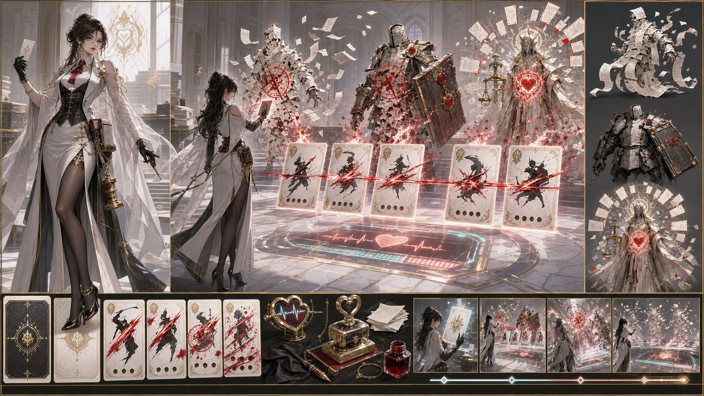
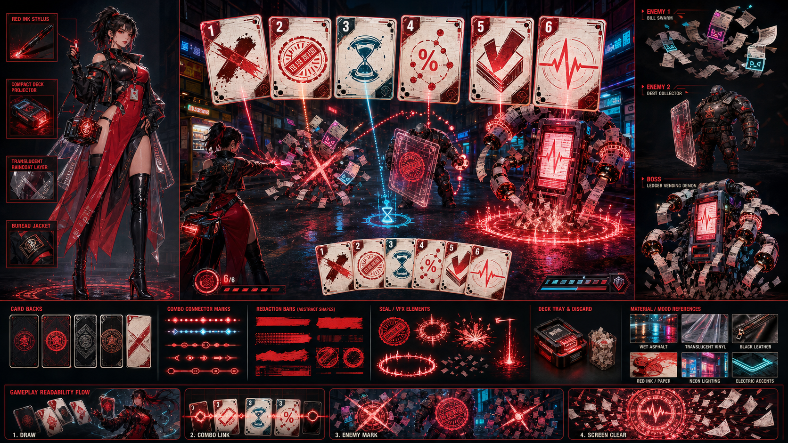
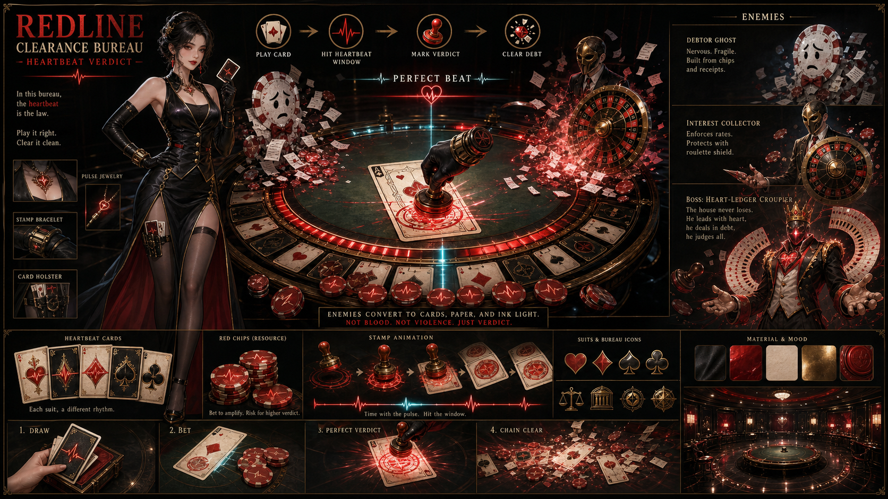
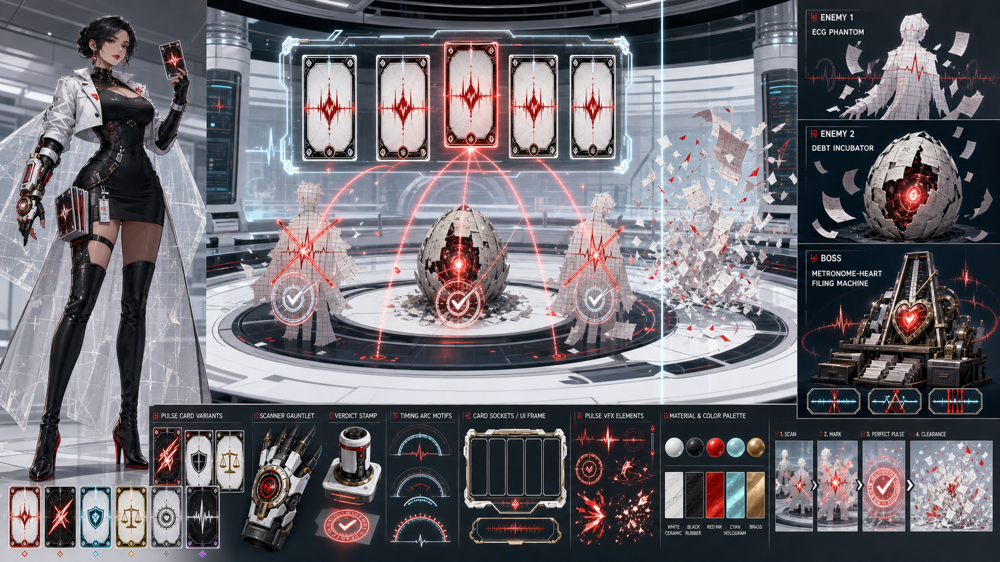
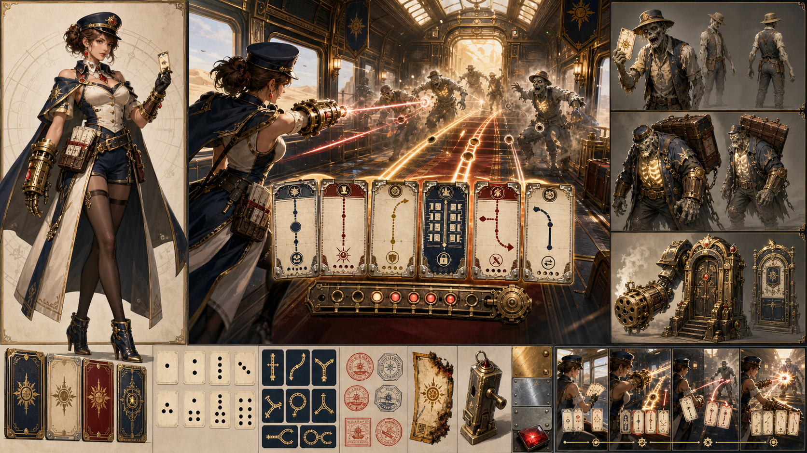
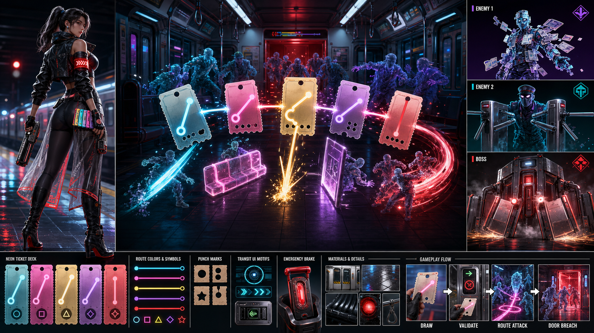
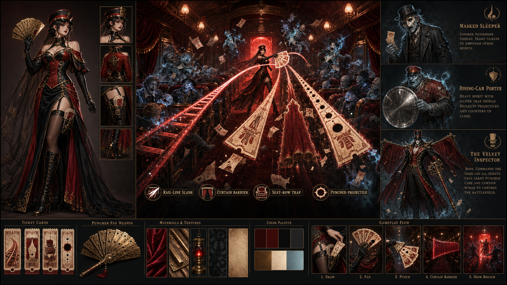
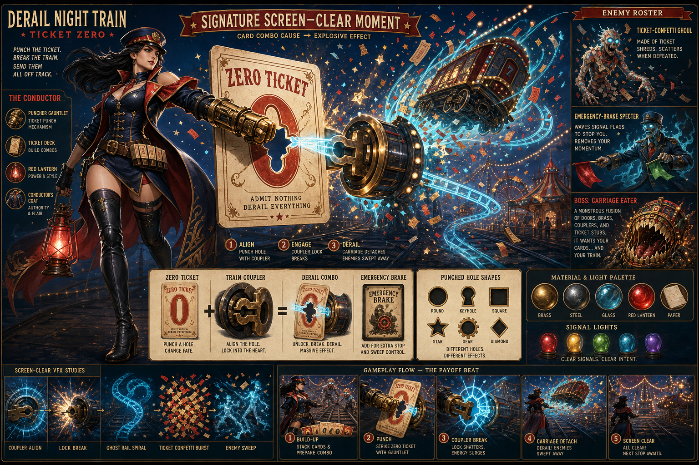

# Iteration 02 美术方向板评估

生成时间：2026-05-10 HKT  
评估对象：`../originals/` 下 8 张第二轮美术方向板  
输入依据：`../optimized-art-direction-prompts.md`、上一轮 `../..//review/2026-05-10-50-lens-image-evaluation.md`  
评估目标：判断哪张图最适合作为下一轮主视觉/系统执行基准，哪张只适合作为灵感参考。

图片说明：本提交版文档使用仓库相对路径，便于后续提交到主干；Codex 桌面本地预览请打开同目录下的 `.local-preview.md`，该文件使用绝对路径并已加入 `.gitignore`。

## 评估口径

本轮仍按 50 位设计师/创作者镜头做综合判断，但不在正文展开 400 个格子的逐项矩阵，而是折算为以下核心问题：

- 3 秒内能不能看懂卖点。
- 主角、敌人、Boss 轮廓是否能记住。
- 卡牌/车票/UI 物件是否能直接转成真实游戏系统。
- 是否像立项用 art direction board，而不是海报、壁纸或单张插画。
- 是否明显跳出上一轮过暗、过哥特的问题。
- 成人擦边是否更明确，同时不越过 Steam 和平台审核的安全边界。

本轮成人向判断边界：

- 加分：成年女性、明确职业身份、露肩/腿部轮廓/高开衩/贴身剪裁/半透明外层、危险但自主持械的姿态。
- 扣分：露点、性行为、被胁迫感、绳缚/SM 误读、身体检查感、图库奖励感。

## 总排名

| 排名 | 图 | 综合分 | 95+ 镜头数 | 判断 |
|---:|---|---:|---:|---|
| 1 | N2-A 日光装甲特急 | 95.10 | 38/50 | 当前最适合进入主视觉 + 系统执行 |
| 2 | R2-D 医疗脉冲清算实验室 | 94.70 | 34/50 | 红线当前最适合做系统/UI 方向 |
| 3 | R2-A 白金审计处刑局 | 94.40 | 32/50 | 红线当前最适合做市场首屏方向 |
| 4 | N2-B 霓虹末班地铁 | 94.20 | 31/50 | 非哥特突破强，但标签文字明显 |
| 5 | N2-C 红绒卧铺剧场 | 93.10 | 24/50 | 成人市场 hook 最强，但回到暗红哥特 |
| 6 | R2-B 霓虹红账街 | 92.80 | 22/50 | 机制可读强，但文字过多且风格偏泛赛博 |
| 7 | R2-C 心跳赌桌判定室 | 91.90 | 18/50 | 成人 hook 强，但太像带说明文字的提案页 |
| 8 | N2-D 断钩清屏嘉年华 | 89.60 | 10/50 | 清屏记忆点强，但尺寸和文字严重拖分 |

## 一句话结论

如果下一步要选主线视觉，我建议：

1. **夜车主线选 N2-A 日光装甲特急。** 它第一次把夜车从纯哥特里拉出来，同时保留了车票、轨道、女列车长、战斗 lane 和卡牌系统。
2. **红线主线选 R2-A + R2-D 合并。** R2-A 负责市场首屏和角色吸引力，R2-D 负责机制/UI/战斗清晰度。
3. **N2-B 可以作为夜车现代化备选。** 它最不像旧哥特，但目前文字标签太重，重生成时必须强控 no text。
4. **N2-C 只作为成人擦边强度参考。** 它证明擦边能增强点击，但不能让整个项目滑成“红绒成人秀场”。

## 评分维度表

| 图 | 3 秒卖点 | 成人角色吸引力 | 系统可转化 | 敌人/Boss 记忆 | 风格差异 | Board 可执行 | 审核稳健 |
|---|---:|---:|---:|---:|---:|---:|---:|
| R2-A 白金审计处刑局 | 95 | 96 | 93 | 94 | 95 | 94 | 94 |
| R2-B 霓虹红账街 | 95 | 94 | 96 | 93 | 96 | 86 | 90 |
| R2-C 心跳赌桌判定室 | 94 | 96 | 92 | 93 | 88 | 84 | 91 |
| R2-D 医疗脉冲清算实验室 | 94 | 95 | 96 | 93 | 96 | 93 | 95 |
| N2-A 日光装甲特急 | 95 | 94 | 96 | 94 | 96 | 95 | 94 |
| N2-B 霓虹末班地铁 | 96 | 95 | 95 | 93 | 97 | 90 | 93 |
| N2-C 红绒卧铺剧场 | 94 | 97 | 92 | 93 | 88 | 89 | 92 |
| N2-D 断钩清屏嘉年华 | 93 | 95 | 90 | 95 | 94 | 78 | 82 |

## 图 1：R2-A 白金审计处刑局



综合分：94.40  
用途判断：红线市场首屏候选。

优点：

- 明显跳出了纯黑红哥特，白金、办公室、审计处刑局的商业化质感很强。
- 成年女性主角轮廓清楚，擦边通过服装剪裁和腿部轮廓表达，没有越界。
- 右侧敌人/Boss 的纸张、盔甲、审计心脏符号都能形成记忆点。
- 中央卡牌连锁和红 ink strike-through 可以读成玩法。

问题：

- 画面还是偏“精致角色 + 卡牌攻击”，系统拆解性弱于 R2-D。
- 心跳/判定 UI 有，但不如 R2-D 清楚。
- 红色飞溅有少量血感风险，后续可进一步改成更干净的 red ink stroke。

结论：保留为红线的市场首屏方向。下一轮不要照抄全图，而是把角色和白金办公室气质合并进 R2-D 的系统板。

## 图 2：R2-B 霓虹红账街



综合分：92.80  
用途判断：红线机制/街机风格参考。

优点：

- 卡牌 combo、敌人标记、screen clear 的流程非常清楚。
- 霓虹城市把红线题材从哥特里拉出来，有新的 Steam 首屏空间。
- 成人女性角色吸引力更强，比上一轮红线角色更市场化。

问题：

- 可读英文标签太多，已经影响“无文字方向板”的交付质量。
- 风格偏泛赛博/泛霓虹，红线清算局的独特办公审计感被削弱。
- 成人擦边较强但略接近普通手游皮肤感，需要更强职业身份来压住。

结论：保留 card combo 和霓虹街区色彩，不作为主视觉。下一轮如果重生成，要去掉所有标签，让街机 UI 通过图形而非文字表达。

## 图 3：R2-C 心跳赌桌判定室



综合分：91.90  
用途判断：成人 market hook 与心跳赌桌机制参考。

优点：

- 成人角色吸引力强，赌场判定室有明确高风险、心跳、交易感。
- “下注、判定、盖章、清除”的循环很容易改写成卡牌节奏系统。
- 视觉上很适合 Steam capsule 或宣传图。

问题：

- 大量 logo、标题、说明文字、敌人介绍文字，严重偏离 no text 方向板要求。
- 画面像已经做好的营销页，而不是纯视觉 art direction board。
- 赌场和成人擦边叠加后，审核风险略高于白金办公室/医疗实验室方向。

结论：只保留“赌桌判定/筹码资源/心跳 perfect beat”的机制气质，不作为主基准图。

## 图 4：R2-D 医疗脉冲清算实验室



综合分：94.70  
用途判断：红线系统/UI 主基准。

优点：

- 明亮、干净、非哥特，和上一轮有显著区分。
- 卡牌、心跳、扫描、判定、清除全部可读，最适合拆成 Web 原型 UI。
- 成年女性角色具备吸引力，但没有过强色情误读。
- 医疗/审计/脉冲三个元素能自然解释 heartbeat verdict。

问题：

- 右侧和底部仍有英文标签，需要下一轮严格去字。
- 角色更偏科幻医疗，红线清算局的“红笔审计/金融恐怖”味道略弱。
- 敌人设计偏抽象纸人，Boss 记忆点不如 R2-A。

结论：红线机制执行首选。下一轮应做 `R2-A 角色+世界观` 与 `R2-D 系统/UI` 的合并版。

## 图 5：N2-A 日光装甲特急



综合分：95.10  
用途判断：本轮综合第一，夜车主视觉 + 系统执行首选。

优点：

- 成功把夜车从纯黑暗哥特拉到日光、装甲、黄铜、沙漠特急方向。
- 成年女性列车长角色有吸引力，服装擦边明确但仍是职业角色。
- 车票、轨道、卡牌、验票器、敌人 wave、走廊 lane 都非常可执行。
- 三秒内能看懂“女列车长用车票卡牌在车厢里清怪”。

问题：

- 和“夜车”原名略有冲突，日光方向可能需要改成“黄昏/晨光/荒原特急”。
- 有一点蒸汽朋克/西部冒险味，需要保留零号车票和断轨记忆点防止跑偏。
- 成人擦边适中，但比 N2-C 弱。

结论：当前最值得进入下一轮 GDD/视觉基准。它既商业，又可做系统，又解决了过暗问题。

## 图 6：N2-B 霓虹末班地铁



综合分：94.20  
用途判断：夜车现代化备选。

优点：

- 非哥特突破最大，现代地铁 + 彩色票卡 + 都市怪潮非常醒目。
- 成人女列车员角色有强市场吸引力。
- 彩色路线卡牌非常适合转成真实系统。
- 画面更接近年轻用户、直播切片和移动端广告审美。

问题：

- 大量英文标签和 UI 字符拖分。
- 现代地铁会削弱“断轨夜车”的独特 IP 感，容易变成泛赛博地铁 roguelite。
- 中央玩法很清楚，但“零号车票/断钩清场”的核心记忆点不如 N2-A/N2-D。

结论：作为现代化分支保留。若后续想测更年轻、更全球化的首屏，可以单独用它做 capsule A/B。

## 图 7：N2-C 红绒卧铺剧场



综合分：93.10  
用途判断：成人擦边强度参考。

优点：

- 当前 8 张里成人市场 hook 最强，角色更像 Steam 成人边缘用户会点的图。
- 车票扇、红绒卧铺、剧场车厢、亡灵乘客形成强烈氛围。
- 仍能读出“车票变武器”的核心玩法。

问题：

- 又回到了暗红、哥特、剧场、吸血鬼式氛围，和本轮“跳出暗黑哥特”的目标冲突。
- 英文标签较多。
- 如果继续强化，容易变成“红绒成人秀场”，削弱卡牌清怪爽感。

结论：保留角色服装和红绒材质作为擦边强度上限，不建议做主方向。

## 图 8：N2-D 断钩清屏嘉年华



综合分：89.60  
用途判断：清屏记忆点参考，不作为合格方向板。

优点：

- 断钩清屏、零号车票、车厢飞离、嘉年华灯光的记忆点非常强。
- 成人女列车长市场 hook 明确。
- 如果只看宣传图，它会很有点击力。

问题：

- 尺寸是 `1536 x 1024`，不是本轮要求的 16:9。
- 大量可读文字、标题、说明和 UI 标签，严重违反方向板约束。
- 更像海报/说明页，而不是无文字 art direction board。
- 卡牌系统被巨大 key art 压住，作为游戏系统基准不够稳。

结论：只保留“断钩清屏嘉年华”的清屏瞬间和色彩想法。后续如果要用，需要重生成严格 16:9、无文字、更多底部系统物件的版本。

## 本轮和上一轮对比

| 问题 | 上一轮状态 | 第二轮变化 | 结论 |
|---|---|---|---|
| 过暗、过哥特 | 明显 | N2-A、N2-B、R2-A、R2-D 已明显拉开 | 已改善 |
| 成人擦边不足 | 明显不足 | N2-C、R2-C、R2-B、N2-B 明显增强 | 已改善，但需控风险 |
| 系统可读性 | N-B、R-C 最强 | N2-A、R2-D、N2-B 可接棒 | 已改善 |
| 无文字方向板 | 部分有问题 | 第二轮更严重，尤其 R2-B/R2-C/N2-C/N2-D | 新问题 |
| 商业首屏 | 中等 | N2-A、N2-B、R2-A 明显增强 | 已改善 |

## 当前推荐路线

### 红线清算局

主线不要选单张，而是合并两张：

- 角色/市场/世界观：`R2-A 白金审计处刑局`
- 机制/UI/原型：`R2-D 医疗脉冲清算实验室`

下一轮提示词方向：

```text
white-gold supernatural audit bureau + clean pulse verdict lab,
adult female execution auditor,
case cards as physical cards,
heartbeat timing window,
red ink strike-through and audit seals,
bright premium office, not gothic,
no written labels, no readable text.
```

### 断轨夜车

主线优先选：

- `N2-A 日光装甲特急`

备选测试：

- `N2-B 霓虹末班地铁` 用于更年轻、更现代的 Steam capsule A/B。
- `N2-C 红绒卧铺剧场` 只用于成人擦边强度参考。
- `N2-D 断钩清屏嘉年华` 只用于清屏大招和 trailer moment。

下一轮提示词方向：

```text
golden-hour armored night express,
adult female conductor,
ticket cards as physical combat engine,
rail-line attacks, punch holes, validator machine,
sunlit but haunted,
screen-clear coupler break as one thumbnail,
no written labels, no readable text.
```

## 最终建议

如果只能选一个提案继续美术深化，我现在建议选 **断轨夜车：零号车票**，以 `N2-A 日光装甲特急` 为主方向。

原因：

- 它比红线更容易把“卡牌即物件”做成真实系统。
- 它解决了上一轮过暗问题，但没有丢掉怪潮清场。
- 角色擦边、职业身份、车票系统、走廊战斗同时成立。
- 它更适合 Web 原型先做出“能玩”的系统。

红线不废弃。红线更适合等下一轮把 `R2-A + R2-D` 合并后，再作为市场首屏更强的第二方案比较。
